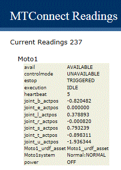
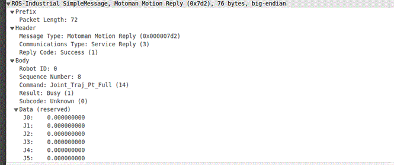
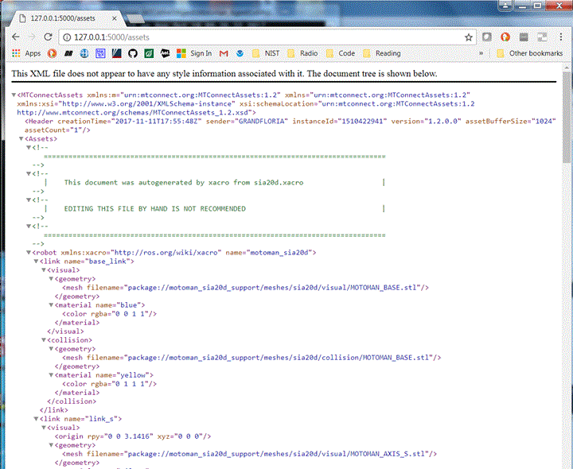
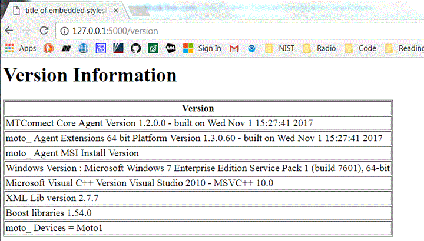

# README
 
----

Saturday, November 11, 2017
This document presents a brief background on the mechanics of an MTConnect Agent implementation for a Motoman Robot supporting the ROS Industrial Simple Message communication protocol.  Our robot lab has a Motoman SIA-20-F-A00 which has support for ROS-I simple message communication protocol, and was used to read the status of the robot and report the results in an MTConnect Agent. Probably the biggest drawback with the Simple Message communication protocol is that it is purely joint (or axis) based robot communication specification. This means commanding the robot to different position using advanced joint control techniques is possible but not lower level joint information (load, current, etc.)., but tooling, Cartesian control and general IO command and control are not part of the Simple Message specification.   Yaskawa the maker of Motoman robots coded up a Simple Message interface, and while adhering to the basic communication principles, extended the specification to include IO command and control. However, other robot makers who do not participate in the ROS-I consortium have not implemented the basic Simple Message interface, nor any extensions.
This document concerns itself with how the embedded Motoman ROS-I Simple Message "Adapter" in the Agent operates in order to communicate with a Motoman robot.  ROS-I provides a Motoman "stack" (series of packages) that are part of the ROS-Industrial program [1]. The Motoman stack currently contains packages that provide nodes for communication with Motoman industrial robot controllers (DX100, FS100, DX200, and YRC1000), URDF models for various robot arms and associated ROS configuration packages. Even though ROS-I supplies many ROS Motoman packages, to achieve similar MTConnect status communication with a Motoman, only the driver ROS packages are required for the MTConnect Agent backend Adapter. In addition, the Universal Robot Definition Format (URDF) files matching the physical robot were generated from the ROS-I Motoman packages, but do not require installation of ROS nor ROS-I motorman packages.
Basically, a Motoman adapter reads a configuration file, then reads real-time data from a Motoman robot Simple Message status port using the established Simple Message TCP protocol and translates this information into MTConnect state and data information.   Multiple embedded adapters to Motoman robots are possible, each contained within one MTConnect Agent. This document also describes in detail the data gathering for a Motoman using a socket interface and the ROS-I Simple Message communication protocol. 
The document includes a brief background on MTConnect, ROS-I Simple Message communication protocol, system architecture, communication scheme, and installation notes. This document assumes the reader is familiar with MTConnect operation, and for deeper explanation of MTConnect, please refer to: http://www.mtconnect.org/ for more information. 
# Background 
## MTConnect Overview
MTConnect is an evolving standard developed to facilitate the exchange of data on the manufacturing floor. The MTConnect open specification provides for cost effective data acquisition on the manufacturing floor for machine tools and related devices.  MTConnect is based upon prevalent Web technology including XML and HTTP.   Figure 1 shows the MT Connect architecture. An "MTConnect Device" is a piece of equipment – in this case a Motoman robot, which (optionally) includes an MTConnect Adapter so that we can get data from it. The "Agent" is a process that acts as a "bridge" between a device and a factory "Client Application".  To learn more about MTConnect visit: http://www.mtconnect.org/ 
Figure 1 shows a typical MTConnect Motoman Robot system architecture (with one or more Motoman robot devices). Communication between a Windows PCs and the Motoman robot is assumed, communicating over Ethernet to communicate the Motoman robot status.

_Figure 1 MTConnect Motoman Robot Agent system architecture_

This document describes the communication and data gathering software technology used to communicate with a Motoman robot to provide data for an MTConnect Agent to make available to clients. Multiple adapters to Motoman robots are possible, each contained within one MTConnect Agent.
Motoman robot is a product of Yaskawa.  Yaskawa Motoman is a global industrial robotics company. Yaskawa provides automation products for many industry and robotic application; including arc welding, assembly, coating, dispensing, material handling, material cutting, material removal, packaging, palletizing and spot welding. The  Motoman SIA20D Is a compact 7 axis degree of-freedom Robot Arm. The 7-axis actuator-based design is a redundant kinematic robot  with ability to maneuver in very tight areas.  Redundant joints allows dexterity that enables the robot to reorient elbow(s) without affecting hand position or causing self-interference. 
Of interest in this document is reporting status of Motoman robots. At a low level of control, a ROS-I Simple Message interface was installed and tested. ROS-I supplies a Simple Message driver to DX or FX motoman controllers. Details can be found at http://wiki.ros.org/motoman_driver. Using the ROS-I driver embedded in the Motoman controller monitoring status of a Motoman robot is done by writing a client application, in this case the MTConnect Agent, and connecting to Motoman Control using a TCP/IP socket, with these parameters:
 - Hostname IP 
 - Status socket port: 50241
The Motoman MTConnect Agent contains a back-end adapter that communicates with the Motoman controller via the TCP/IP status socket. With the MTConnect Agent running, a connection to each Motoman robot is established to receive status communication from the robot. Then, if you bring up a browser and enter the IP plus port 5000 and the command current, e.g., http://xxx.xxx.xxx.xxx:5000/current the Agent will return the current state of the data items in the Motoman robot. Shown below is a formatted output table from a VB script that extracts the MTConnect Agent XML from one Motoman robot.

_Figure 2 Web-browser Display Showing Table of MTConnect Agent Data Items_

The Motoman TCP/IP communication streams the status of the robot over the socket connection. The MTConnect Agent back-end adapter reads the status, and decodes these Motoman robot message into a series of C++ structures. These Motoman Simple Message status interfaces include:

		struct joint_traj_pt_state_message;
		struct robot_status_message;
		struct joint_feedback_message;	

Within these data buffers the Motoman robot status is collected and then interpreted into MTConnect standard data items. Although many MTConnect items are CNC–centric and aren't intuitively reflected within the Motoman robot status buffers (e.g., MANUAL versus AUTOMATIC mode), it is possible to convert the Motoman robot status into an MTConnect device status representation.  Assuming a Simple Message status interface, the Motoman robot may require more status information for advanced robot prognostic and health, but is sufficient for general OEE applications.
<TABLE>
<TR>
<TD>MTConnect Data Item </TD>
<TD>Motoman robot interface item </TD>
</TR>
<TR>
<TD>power  </TD>
<TD>ON if mMotoData.robot_status.drives_powered  </TD>
</TR>
<TR>
<TD>mode  </TD>
<TD>AUTO?  </TD>
</TR>
<TR>
<TD>execution </TD>
<TD>ACTIVE: mMotoData.robot_status.in_motion  INTERRUPTED: unclear READY: state not above </TD>
</TR>
<TR>
<TD>axes status </TD>
<TD>mMotoData.jnt_feedback.pos[i]  i=1,6 </TD>
</TR>
<TR>
<TD>estop </TD>
<TD>TRIGGERED: if mMotoData.robot_status.e_stopped ARMED: otherwise </TD>
</TR>
<TR>
<TD>fovr </TD>
<TD>NA </TD>
</TR>
<TR>
<TD>pose or PATH_POSITION </TD>
<TD>NA </TD>
</TR>
<TR>
<TD>message </TD>
<TD>NA  </TD>
</TR>
</TABLE>

The match between a CNC-centric MTConnect and a robot domain is not perfect.  The description of axes (joints in robot terminology) is one apparent difference. The natural match, a "rotary" axis in MTConnect (such as a CNC spindle), is considered a continuous axis in typical robot terminology. However, the concept of a rotary MTConnect axis was used, but was treated as a robot rotary joint (with units in radians not RPM and not continuous). This was among some of the differences in coalescing the two-application domain's terminology, but did not cause any major programming issues, but may cause a misunderstanding of output.
# ROS-I Simple Message Communication Protocol
The Simple Message (SimpleMessage) protocol defines the message structure between the ROS driver layer and the robot controller itself. SimpleMessage is a streaming command and status communication protocol. The goal was to make the protocol simple enough to decode in a robot programming language as well as more sophisticated programming languages. There is no version information encapsulated in the protocol.
## Message Structure
All types with the Simple Message are 32 bit types (floats and integers), while the network communication byte order is uncharacteristically "Little Endian". (Not sure this is true – but it's what the documentation says.)  So, if your PC is little Endian, when you read the TCP/IP network communication stream, you do not have to perform any byte swapping.  All robot joint related arrays, e.g., position, velocity, and acceleration, used in the Simple Message protocol are of a fixed maximum size: 10. If you happen to have an 11-joint robot you cannot use Simple Message. This is highly unlikely unless your robot is for example an Android with two arms and a head. But for most industrial robots, this maximum joint limit is sufficient.
All messages in the Simple Message protocol adopt this basic structure:
 - PREFIX (not considered part of the message)
 	- int LENGTH (HEADER + DATA) in bytes
 - HEADER
 	- int MSG_TYPE identifies type of message (standard and robot specific values)
 	- int COMM_TYPE identified communications type
 	- int REPLY CODE reply code (only valid in service replies)
 - BODY
 	- ByteArray DATA variable length data determined by message type and and communications type.
 
The Simple Message protocol allows for an arbitrary data payload for message and communications types.  In fact, the vendor Yaskawa of the Motoman robots extended the Simple Message protocol with their own command definitions. Because of this, both the client/server model must understand the data payload associated with the different message and communications types. The typed message class enforces the data payload structure.  
The data is streamed as raw binary over both the command and the status ports. Typically, the command port is defined as 11000 and the status port is defined as 11002. However, the TCP/IP socket ports for the Motoman Simple Message implementation are 50240 and 50241.
For troubleshooting purposes Wireshark can be used to monitor network traffic, and a Lua Wireshark dissector plugin for the simple message protocol is available from ros-industrial/packet-simplemessageat GitHub. See the readme for information on how to install it.  The following screenshot shows a snapshot of Wireshark trace of Simple Message network traffic for the reply from a Joint Trajectory Point FULL while still moving to the goal is 1 (BUSY). 

_Figure 3 Snapshot of Wireshare Dissector of Simple Message Communication_

The ROS-I motorman packages work within ROS out of the box and one is able to code up a Motoman application or use RVIZ to move the physically move the robot. To use a MTConnect Agent to collect status information, or apply Simple Message communication protocol for other status purposes, NIST has captured a raw Simple Message status stream  and saved the data in a readable ASCII format that can be used to test client applications. NIST has written a pair of application to capture and replay raw socket data. The capture is time stamped so replay approximates the transmission rate of communication packets as if they were coming from the actual robot.   We have collected some Motoman 7 DOF status that can be replayed with the Socket_replay application, using either a command line interface, a WIN32 GUI on Windows, or using QT GUI application on either Linux or Windows. 
# Motoman Robot URDF  Information from MTConnect Agent
Enterprise integration of Motoman factory robots using MTConnect would be beneficial for OEE, simulation, downtime and repair response, prognostics and health management, among other client applications. One aspect of robot's utility that is useful is a complete model of the robot. For example, the popular Robot Operating System (ROS) uses the Unified Robot Description Format (URDF) as a general-purpose robot model, which includes a wide range of robot specification information. 
ROS uses the Unified Robot Description Format (URDF) as a general-purpose robot specification model. URDF covers the kinematic and dynamic description of the robot, the visual representation of the robot, and the collision model of the robot. Of note, since URDF is an XML specification, URDF is limited to robots that exhibit only tree structures representations, ruling out all parallel robots like Stewart Platforms. However, most Industrial Robots are kinematic chain robots and so can be modeled as a serial set of links and joints. Multi-arm robots can also be modeled in URDF as a kinematic tree of links connected to multiple joints, such as a headed robot with two arms. 
URDF is an XML specification to describe a robot. Because it is an XML specification, the information is modeled as a tree with elements (e.g., "<Name>'') with subelement branches under elements. Each robot is modeled in ROS by an URDF file, which contains 
**Link Information** Link elements describe a rigid body with a geometry, inertia, visual features, obstacle bounds and other robot properties. The visual element within the link element contains the specification for display of the link in visualization tool (either a mesh or a geometry element). The visual also contains the material element which sets the color of the link.

**Joint Information** Joint elements describe the kinematics and dynamics of the joint and also specify the safety limits of the joint. Joint elements contain elements for parent link, child link, axis of rotation, calibration, dynamics, limit, and safety controller information. Joints are also able to mimic other joints. URDF  assumes each joint is either a revolute, prismatic, fixed, or continuous type joint which depending on the type can have position, velocity and effort limits specified.

Fortunately, MTConnect has the capability to seamlessly pass this URDF information to clients.  Besides the device data items, MTConnect standard addresses other auxiliary manufacturing equipment that are not a component of a machine[2]. To allow generating and managing such auxiliary data models at runtime, MTConnect assets were introduced. Examples of MTConnect assets are objects like cutting tools, workholding systems, parts and fixtures. MTConnect assets offer a good framework for future expansions so that the URDF robot specification information can be seamlessly channeled through MTConnect Agent as an asset.
Since MTConnect can incorporate and transport standardized XML data developed independently from the core MTConnect information models, passing URDF XML as an asset is straightforward. MTConnect defines "assets as an associative array of key/value stores in which to store the XML. This allows the ability to collect and report entire XML documents as they change within applications. Below, the XML shows how an AssetChanged tag with an asset type  URDF  and  MODEL value that would be updated within the MTConnect XML query to indicate new quality results from an inspection.

	<AssetChanged dataItemId="dev_asset_chg" 
	timestamp="2017-09-08T19:42:16.855924Z" sequence="46" 
	assetType="URDF">MODEL</AssetChanged>
For our implementation, the ROS URDF  XML was used that is then accessible via the Internet with the following query to an MTConnect Agent:

	http://xxx.xxx.xxx.xxx/asset/MODEL?type=URDF 
where xxx.xxx.xxx.xxx is the IP address of the MTConnect server and which returns an URDF XML "web page". So, the URDF is conveyed to MTConnect clients as "Assets". If you on the host machine of the Motoman MTConnect Agent and type in the Motoman  http://127.0.0.1:5000/assets, you will get a XML description with the URDF XML embedded inside the MTConnect XML. Below is a screen snapshot of the assets query of the MTConnect Agent for the asset named Motoman 5.

_Figure 4 URDF Asset for Motoman sia20d_ 

Within the Motoman Agent, in order to convey the asset, you need to have an asset declared in the MTConnect devices data item specification. Thus, the MTConnect probe must contain a data item to reflect the existence of the URDF  asset.  

	<DataItem id="Motoman_sia20d_urdf_asset" type="ASSET_CHANGED" category="EVENT"/>

For the Motoman MTConnect Agent to be reported via a query, C++ code transferred a URDF file that was read into a string and then passed into the core MTConnect Agent using the addAsset function call. To alleviate XML confusion, the URDF header <?xml version="1.0" ?> was removed, or a web browser would hang at the returned XML. To use addAsset, the device, the id of the asset data item (Motoman 5_urdf_asset), the textual body of the asset and the type (Robot) of the asset must be provided, as shown below:

	void AdapterT::addUrdfAsset (std::string urdfstr)
	{
	    std::string aId = this->mDevice + "_urdf_asset";
	
	    // remove the <?xml version="1.0" ?> as it messes up web browsers
	    size_t n = urdfstr.find("?>");
	
	    if ( n != std::string::npos )
	    {
	        urdfstr = urdfstr.substr(n + 2);
	    }
	
	    // <DataItem id="m1_urdf_asset" type="ASSET_CHANGED" category="EVENT"/>
	    std::string aBody = urdfstr;
	    std::string type  = "Robot";
	
	    ::Device *device = mAgentconfig->getAgent( )->getDeviceByName(mDevice);
	
	    mAgentconfig->getAgent( )->addAsset(device, aId, aBody, type);
	}

Once the asset has been registered with the Agent, the MTConnect Agent status for the Motoman 5_urdf_asset  data item reflects that data is available.
# Version Information from MTConnect Agent
The version information of the various MTConnect components is available through web browser access. It is uses simple XSLT formatting of the XML. The open source core MTConnect Agent is downloaded from github and "frozen". The 1.2 version is used but is rebuilt when the entire Agent is compiled.  

	MTConnect Core Agent Version 1.2.0.0 - built on Wed Oct 18 17:37:49 2017
It is not perfect but the output shown below gives an indication of the software involved in the MTConnect Agent operation. It can be modified to include other version information, but requires a recompilation at this time.
Thus, to get the version information in a web page, one can log onto the host PC of the MTConnect Agent, start a web browser, and type in this Motoman L:

	http://127.0.0.1:5000/version
If the Motoman MTConnect Agent is running you should receive a formatted Web Page as follows:

_Figure 5 Motoman MTConnect Agent Version Table_

## Use of NIST Information
This document is provided as a public service by the National Institute of Standards and Technology (NIST). With the exception of material marked as copyrighted, information presented on these pages is considered public information and may be distributed or copied. Use of appropriate byline/photo/image credits is requested.
## Software Disclaimer
NIST-developed software is provided by NIST as a public service. You may use, copy and distribute copies of the software in any medium, provided that you keep intact this entire notice. You may improve, modify and create derivative works of the software or any portion of the software, and you may copy and distribute such modifications or works. Modified works should carry a notice stating that you changed the software and should note the date and nature of any such change. Please explicitly acknowledge the National Institute of Standards and Technology as the source of the software.
NIST-developed software is expressly provided "AS IS." NIST MAKES NO WARRANTY OF ANY KIND, EXPRESS, IMPLIED, IN FACT OR ARISING BY OPERATION OF LAW, INCLUDING, WITHOUT LIMITATION, THE IMPLIED WARRANTY OF MERCHANTABILITY, FITNESS FOR A PARTICULAR PURPOSE, NON-INFRINGEMENT AND DATA ACCURACY. NIST NEITHER REPRESENTS NOR WARRANTS THAT THE OPERATION OF THE SOFTWARE WILL BE UNINTERRUPTED OR ERROR-FREE, OR THAT ANY DEFECTS WILL BE CORRECTED. NIST DOES NOT WARRANT OR MAKE ANY REPRESENTATIONS REGARDING THE USE OF THE SOFTWARE OR THE RESULTS THEREOF, INCLUDING BUT NOT LIMITED TO THE CORRECTNESS, ACCURACY, RELIABILITY, OR USEFULNESS OF THE SOFTWARE.
You are solely responsible for determining the appropriateness of using and distributing the software and you assume all risks associated with its use, including but not limited to the risks and costs of program errors, compliance with applicable laws, damage to or loss of data, programs or equipment, and the unavailability or interruption of operation. This software is not intended to be used in any situation where a failure could cause risk of injury or damage to property. The software developed by NIST employees is not subject to copyright protection within the United States.

# Bibliography

<TABLE>
<TR>
<TD>[1]  </TD>
<TD>A. Larson, "Rethink's Baxter vs Universal Robots: Which Collaborative Robot is best for you?," 22 1 2013. [Online]. Available: cross-automation.com/blog/rethinks-baxter-vs-universal-robots-which-collaborative-robot-best-you. [Accessed 17 10 2017]. </TD>
</TR>
<TR>
<TD>[2]  </TD>
<TD>T. Trautner, F. Pauker and B. Kittl, "ADVANCED MTCONNECT ASSET MANAGEMENT (AMAM)," in International Conference on Innovative Technologies, IN‐TECH 2016, Prague, 2016.  </TD>
</TR>
</TABLE>


