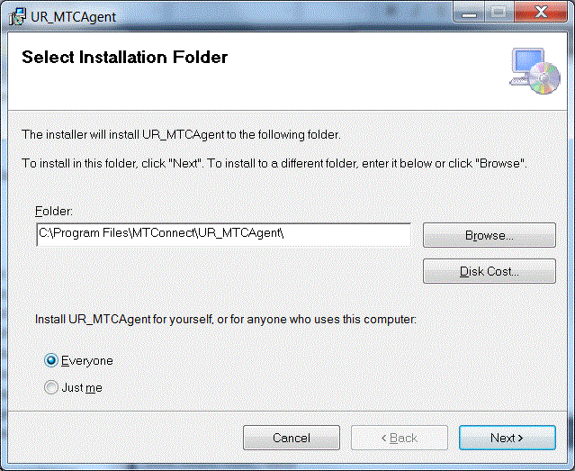
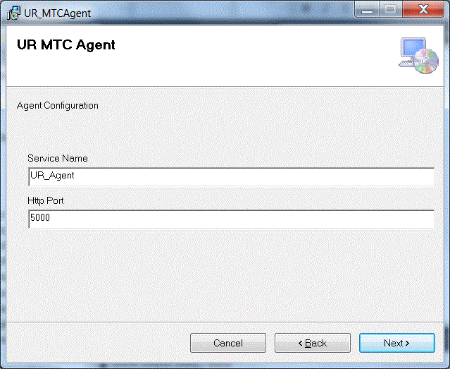
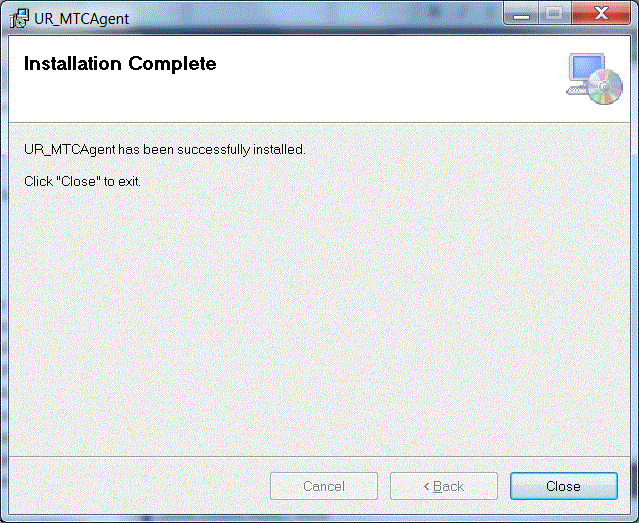
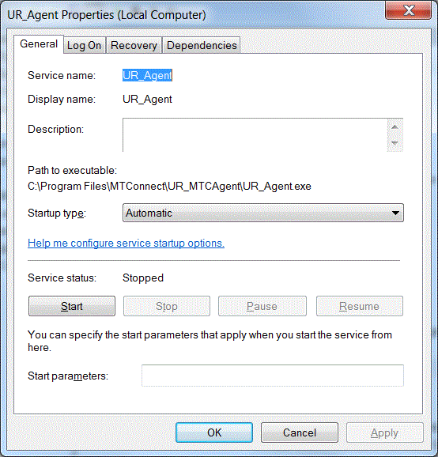
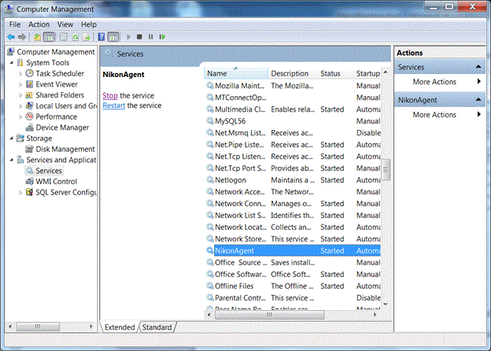
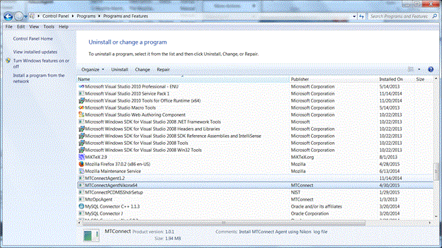

# README
 
----

Friday, October 27, 2017
This document presents a brief background on the mechanics of an MTConnect agent implementation for Universal Robots.  This document concerns itself with how the embedded UR "Adapter" in the Agent operates in order to communicate with a UR robot. Basically, a UR adapter reads a configuration file, then reads real-time data from a UR robot using the established UR TCP protocol and translates this information into MTConnect state and data information.   Multiple adapters to UR robots are possible, each contained within one MTConnect Agent. This document also describes in detail the data gathering for a Universal Robot (UR) using a socket interface. 
The document includes a brief background on MTConnect, UR robot background, system architecture, communication scheme, and installation notes. This document assumes the reader is familiar with MTConnect operation, and for deeper explanation of MTConnect, please refer to MTConnect URL: http://www.mtconnect.org/ for more information. 
# Background 
## MTConnect Overview
MTConnect is an evolving standard developed to facilitate the exchange of data on the manufacturing floor. The MTConnect open specification provides for cost effective data acquisition on the manufacturing floor for machine tools and related devices.  MTConnect is based upon prevalent Web technology including XML and HTTP.   Figure 1 shows the MT Connect architecture. An "MTConnect Device" is a piece of equipment – in this case a UR robot, which (optionally) includes an MTConnect Adapter so that we can get data from it. The "Agent" is a process that acts as a "bridge" between a device and a factory "Client Application".  To learn more about MTConnect visit: http://www.mtconnect.org/ 
Figure 1 shows a typical MTConnect UR Robot system architecture (with one or more UR robot devices). Communication between a Windows PCs and the UR robot is assumed, communicating over Ethernet to communicate the UR robot status.

_Figure 1 MTConnect NIKON CMM Logging Agent system architecture_

This document describes the communication and data gathering software technology used to communicate with a UR robot to provide data for an MTConnect Agent to make available to clients. Multiple adapters to UR robots software are possible, each contained within one MTConnect Agent.
Universal Robots is a Danish manufacturer of smaller flexible industrial robot arms whose primary application are as collaborative robots. Collaborative robots differ from traditional robots by being able to work side-by-side with human workers as the robots are deemed inherently safe, and thus do not require a fence to safeguard workers from dangerous robot behavior. A collaborative robot differs from a traditional industrial robot due to the fact that a collaborative robot is designed to work alongside human employees, while an industrial robot replaces a worker (as it unsafe for an industrial robot to even be near a human). In theory, a collaborative robot can assist employees with work that may be too dangerous, strenuous, or tedious for them to accomplish on their own, creating a safer, more efficient workplace. By contrast, industrial robots are used to automate the manufacturing process almost entirely without human help on the manufacturing floor. 
UR robots also claim to be more easy to teach program than industrial robots because they can  be programmed by moving the arm to the desired teach position. Industrial robots cannot be so easily reprogrammed since they are dangerous and they require a joystick to move the robot to the desired position. In either case, it would be preferable if the robot could use sensing and background engineering to determine the desired goal position. Many robots use CAD models of the factory to understand the manufacturing environment and goal positions, but this is a non-trivial integration exercise, especially in a one-off production environment.
Figure 1 show the three different sizes of Universal Robots – UR3, UR5 and UR10, which are named for their payload weight in kilograms and vary in size, reach, weight and footprint. The UR robot's somewhat dated basic specification [1]:
 - Max load capacity of 11 lbs for the UR5 (UR5 AE3) and 22 lbs for the UR10
 - Max speed of 1 meter per sec under full load
 - Simple teaching style programming with the ability to create complex logic in a point and click environment
 - Full scripting language for complex programming required
 - I/O handshaking and fieldbus communications
 - Torsion sensing technology for use in collaborative situations
 - Compatible with industrial vision systems such as Cognex
 - Repeatability of +/- 0.004"
 - Environmental Rating of IP54
 - Weight without Pedestal: 40.6 lbs for the UR5 (UR5 AE3) and 63.7 for the UR10
 - Calculated Life of 36000 Hours of Operation at rated loads

_Figure 2 Universal Robots - UR3, UR5, and UR10_


Of interest in this document is reporting status of UR robots. At a low level of control, UR robots have a controller called "URControl", which is the low-level robot controller running on the Mini-ITX PC in the controller cabinet. When the PC boots up URControl starts up as a daemon (like a service) and PolyScope User Interface connects as a client using a local TCP/IP connection and listens for socket connections. Monitoring status of a UR robot is done by writing a client application, in this case the MTConnect Agent, and connecting to URControl using a TCP/IP socket, with these parameters:
 - Hostname IP 
 - port: 30002

The UR MTConnect Agent contains a back end adapter that communicates with the UR controller via the TCP/IP socket. In general, UR supplies three TCP/IP interfaces: primary, secondary and real-time. The secondary communication channel was used to retrieve robot status at 15Hz. With the MTConnect agent running, a connection to each UR robot is established to receive status communication from the robot. Then, if you bring up a browser and enter the IP plus port 5000 and the command current, e.g., http://xxx.xxx.xxx.xxx:5000/current the agent will return the current state of the data items in the UR robot. Shown below is a formatted output table from a VB script that extracts the MTConnect agent XML from one UR robot .

_Figure 3 Web-browser Display Showing Table of MTConnect Agent Data Items_

The UR TCP/IP communication streams the status of the robot over the socket connection. The MTConnect Agent back-end adapter reads the status, and decodes these UR robot message into a series of C++ structures. These UR status interfaces include:

		struct ur_additional_info;
		struct ur_cartesian_info;
		struct ur_configuration_data;
		struct ur_force_mode_data;
		struct ur_joint_data ;
		struct ur_joint_limits;
		struct ur_joint_maxs;
		struct ur_key_message;
		struct ur_label_message;
		struct ur_masterboard_data;
		struct ur_message_header;
		struct ur_popup_message;
		struct ur_request_value_message;
		struct ur_robot_comm_message;
		struct ur_robot_message;
		struct ur_robot_mode_data ;
		struct ur_runtime_exception_message;
		struct ur_security_message;
		struct ur_text_message;
		struct ur_tool_data;
		struct ur_var_message;
		struct ur_version_message;

Importantly the interface robot_mode_data, joint_data, cartesian_data, version_message, masterboard_data, and configuration_data are the status data buffers that are used by the MTConnect back-end Adapter. Within these data buffers the UR robot status is collected and then interpreted into MTConnect standard data items. Although many MTConnect items are CNC –centric and aren't intuitively reflected within the UR robot status buffers (e.g., MANUAL versus AUTOMATIC mode), it is possible to convert the UR robot status into an MTConnect device status representation.  In fact, the UR robot has more than sufficient status information, so that determining the data items for the MTConnect Agent to monitor when displaying a UR robot state can depend on the particular client application. For example, an OEE client application would require different data items than a client application to determine the prognostic and health of the robot.
<TABLE>
<TR>
<TD>MTConnect Data Item </TD>
<TD>UR robot interface item </TD>
</TR>
<TR>
<TD>power  </TD>
<TD>ON if ur_robot_mode_data.isPowerOnRobot  </TD>
</TR>
<TR>
<TD>mode  </TD>
<TD>Became robotmode and controlmode tags ur_robot_mode_data.robotMode ur_robot_mode_data.controlMode  </TD>
</TR>
<TR>
<TD>execution </TD>
<TD>ACTIVE:ur_robot_mode_data.isProgramRunning INTERRUPTED:ur_robot_mode_data.isProgramPaused  READY: state not above </TD>
</TR>
<TR>
<TD>axes status </TD>
<TD>ur_joint_data gives position, velocity and other low-level joint parameters as well as joint_mode </TD>
</TR>
<TR>
<TD>estop </TD>
<TD>TRIGGERED: if ur_robot_mode_data.isEmergencyStopped ARMED: otherwise </TD>
</TR>
<TR>
<TD>fovr </TD>
<TD>ur_robot_mode_data.targetSpeedFraction </TD>
</TR>
<TR>
<TD>pose or PATH_POSITION </TD>
<TD>Combination of r_cartesian_info x,y,z,rx,ry,rz values. </TD>
</TR>
<TR>
<TD>message </TD>
<TD>Unclear, many text messages returnd by UR </TD>
</TR>
</TABLE>

The match between a CNC-centric MTConnect and a robot domain is not perfect.  The description of axes (joints in robot terminology) is one apparent difference. The natural match, a "rotary" axis in MTConnect (such as a CNC spindle), is considered a continuous axis in typical robot terminology. However, the concept of a rotary MTConnect axis was used, but was treated as a robot rotary joint (with units in radians not RPM and not continuous). This was among some of the differences in coalescing the two-application domain's terminology, but did not cause any major programming issues, but may cause a misunderstanding of output.
# UR Robot URDF Information from MTConnect Agent
Enterprise integration of UR factory robots using MTConnect would be beneficial for OEE, simulation, downtime and repair response, prognostics and health management, among other client applications. One aspect of robot's utility that is useful is a complete model of the robot. For example, the popular Robot Operating System (ROS) uses the Unified Robot Description Format (URDF) as a general-purpose robot model, which includes a wide range of robot specification information. 
ROS uses the Unified Robot Description Format (URDF) as a general-purpose robot specification model. URDF covers the kinematic and dynamic description of the robot, the visual representation of the robot, and the collision model of the robot. Of note, since URDF is an XML specification, URDF is limited to robots that exhibit only tree structures representations, ruling out all parallel robots like Stewart Platforms. However, most Industrial Robots are kinematic chain robots and so can be modeled as a serial set of links and joints. Multi-arm robots can also be modeled in URDF as a kinematic tree of links connected to multiple joints, such as a headed robot with two arms. 
URDF is an XML specification to describe a robot. Because it is an XML specification, the information is modeled as a tree with elements (e.g., "<Name>'') with subelement branches under elements. Each robot is modeled in ROS by an URDF file, which contains 
**Link Information** Link elements describe a rigid body with an geometry, inertia, visual features, obstacle bounds and other robot properties. The visual element within the link element contains the specification for display of the link in visualization tool (either a mesh or a geometry element). The visual also contains the material element which sets the color of the link.

**Joint Information** Joint elements describe the kinematics and dynamics of the joint and also specify the safety limits of the joint. Joint elements contain elements for parent link, child link, axis of rotation, calibration, dynamics, limit, and safety controller information. Joints are also able to mimic other joints. URDF assumes each joint is either a revolute, prismatic, fixed, or continuous type joint which depending on the type can have position, velocity and effort limits specified.

Fortunately, MTConnect has the capability to seamlessly pass this URDF information to clients.  Besides the device data items, MTConnect standard addresses other auxiliary manufacturing equipment that are not a component of a machine[2]. To allow generating and managing such auxiliary data models at runtime, MTConnect assets were introduced. Examples of MTConnect assets are objects like cutting tools, workholding systems, parts and fixtures. MTConnect assets offer a good framework for future expansions so that the URDF robot specification information can be channeled through MTConnect agent as an asset.
Since MTConnect can incorporate and transport standardized XML data developed independently from the core MTConnect information models, passing URDF XML as an asset is straightforward. MTConnect defines "assets as an associative array of key/value stores in which to store the XML. This allows the ability to collect and report entire XML documents as they change within applications. Below, the XML shows how an AssetChanged tag with an asset type  URDF and  MODEL value that would be updated within the MTConnect XML query to indicate new quality results from an inspection.

	<AssetChanged dataItemId="dev_asset_chg" 
	timestamp="2017-09-08T19:42:16.855924Z" sequence="46" 
	assetType="URDF">MODEL</AssetChanged>
For our implementation, the ROS URDF XML was used that is then accessible via the Internet with the following query to an MTConnect agent:

	http://xxx.xxx.xxx.xxx/asset/MODEL?type=URDF
where xxx.xxx.xxx.xxx is the IP address of the MTConnect server and which returns an URDF XML "web page". So, the URDF is conveyed to MTConnect clients as "Assets". If you on the host machine of the UR MTConnect agent and type in the URL http://127.0.0.1:5000/assets, you will get a XML description with the URDF XML embedded inside the MTConnect XML. Below is a screen snapshot of the assets query of the MTConnect agent for the asset named UR5.

_Figure 4 URDF for UR5 Robot as MTConnect Asset_

Within the UR Agent, in order to convey the asset, you need to have an asset declared in the MTConnect devices data item specification. Thus, the MTConnect probe must contain a data item to reflect the existence of the URDF asset.  

	<DataItem id="UR5_urdf_asset" type="ASSET_CHANGED" category="EVENT"/>

For the UR MTconnect agent to be reported via a query, C++ code transferred a URDF file that was read into a string and then passed into the core MTConnect agent using the addAsset function call. To alleviate XML confusion, the URDF header <?xml version="1.0" ?> was removed, or a web browser would hang at the returned XML. To use addAsset, the device,  the id of the asset data item (UR5_urdf_asset), the textual body of the asset and the type (Robot) of the asset must be provided, as shown below:

	void AdapterT::addUrdfAsset (std::string urdfstr)
	{
	    std::string aId = this->mDevice + "_urdf_asset";
	
	    // remove the <?xml version="1.0" ?> as it messes up web browsers
	    size_t n = urdfstr.find("?>");
	
	    if ( n != std::string::npos )
	    {
	        urdfstr = urdfstr.substr(n + 2);
	    }
	
	    // <DataItem id="m1_urdf_asset" type="ASSET_CHANGED" category="EVENT"/>
	    std::string aBody = urdfstr;
	    std::string type  = "Robot";
	
	    ::Device *device = mAgentconfig->getAgent( )->getDeviceByName(mDevice);
	
	    mAgentconfig->getAgent( )->addAsset(device, aId, aBody, type);
	}

Once the asset has been registered with the agent, the MTConnect agent status for the UR5_urdf_asset  data item reflects that data is available.
# Version Information from MTConnect Agent
The version information of the various MTConnect components is available through web browser access. It is uses simple XSLT formatting of the XML. The open source core MTConnect agent is downloaded from github and "frozen". The 1.2 version is used but is rebuilt when the entire agent is compiled.  

	MTConnect Core Agent Version 1.2.0.0 - built on Wed Oct 18 17:37:49 2017
It is not perfect but the output shown below gives an indication of the software involved in the MTConnect Agent operation. It can be modified to include other version information, but requires a recompilation at this time.
Thus, to get the version information in a web page, one can log onto the host PC of the MTConnect Agent, start a web browser, and type in this URL:

	http://127.0.0.1:5000/version
If the UR MTConnect Agent is running you should receive a formatted Web Page as follows:

_Figure 5 UR MTConnect Agent Version Table_

# UR Simulator
UR supplies simulators for all UR robots that run on a Linux box. The simulator is packages as  'ursim-3.4.4-97.tar.gz ont the Universal Robotics' web site. The web site https://www.universal-robots.com/download/?option=26264 contains the different simulator versions matching different UR interfaces and further details on installing and running the simulator are given. Briefly, the UR web site explains how to install the Universal Robots software (GUI and controller) on Ubuntu Linux version 10.04.  You should pick the interface version that matches your  You will need sudo privileges to install the simulation package.  
 1. Download 
 2. Change into the downloaded folder,  and unpackage  the archive, for example, package ursim-3.4.5-100.tar :

	cd /usr/local/ursim/ 

 3. Install the UR robot simulator:
 

	cd /usr/local/ursim/ursim-3.4.5-100 
	./install.sh

 4. Run the simulator:
 

	./start-ursim.sh UR5
You should see a popup Screen:

	> telnet 127.0.0.1 30002
Note, you should check if there is a firewall blocking access to port 30001, 30002 and 30003. This was not a problem on our Ubuntu Linux installations.
Interestingly, the UR web site has simulations for all the interface versions available corresponding to their actual robots. The code for the UR_Agent is supposed to recognize the version differences and resolve the conversion from binary socket communication into C++ UR structures.
# UR Version of Interfaces Table Comparison
The UR communication interface has several incarnations for different versions. This can be confusing. There is a breakdown of each interface in Excel Spreadsheet format supplied by Universal Robots. Instad of scanning across worksheets, the following table attempts to collate each INPUT interface into a table with changes noted between versions.
Foremost is the robot mode interface which supplies the current operating state of the robot:
<TABLE>
<TR>
<TD>Interface </TD>
<TD>1.6 </TD>
<TD>1.7 </TD>
<TD>1.8 </TD>
<TD>3.0 </TD>
<TD>3.1 </TD>
<TD>3.2 </TD>
<TD>3.3 </TD>
<TD>3.4 </TD>
</TR>
<TR>
<TD>Robot Mode Data </TD>
<TD>int packageSize unsigned char packageType  uint64_t timestamp bool isRobotConnected bool isRealRobotEnabled bool isPowerOnRobot bool isEmergencyStopped bool isSecurityStopped bool isProgramRunning bool isProgramPaused unsigned char robotMode double speedFraction </TD>
<TD>ibid </TD>
<TD>ibid </TD>
<TD>int packageSize unsigned char packageType  uint64_t timestamp bool isRobotConnected bool isRealRobotEnabled bool isPowerOnRobot bool isEmergencyStopped bool isProtectiveStopped bool isProgramRunning bool isProgramPaused unsigned char robotMode unsigned char controlMode double targetSpeedFraction double speedScaling </TD>
<TD>ibid </TD>
<TD>int packageSize unsigned char packageType  uint64_t timestamp bool isRobotConnected bool isRealRobotEnabled bool isPowerOnRobot bool isEmergencyStopped bool isProtectiveStopped bool isProgramRunning bool isProgramPaused unsigned char robotMode unsigned char controlMode double targetSpeedFraction double speedScaling double targetSpeedFractionLimit </TD>
<TD>ibid </TD>
<TD>ibid </TD>
</TR>
</TABLE>


<TABLE>
<TR>
<TD>Interface </TD>
<TD>1.6 </TD>
<TD>1.7 </TD>
<TD>1.8 </TD>
<TD>3.0 </TD>
<TD>3.1 </TD>
<TD>3.2 </TD>
<TD>3.3 </TD>
<TD>3.4 </TD>
</TR>
<TR>
<TD>Joint  data </TD>
<TD>double q_actual double q_target double qd_actual float I_actual float V_actual float T_motor float T_micro unsigned char jointMode </TD>
<TD>ibid </TD>
<TD>ibid </TD>
<TD>ibid </TD>
<TD>ibid </TD>
<TD>ibid </TD>
<TD>ibid </TD>
<TD>ibid </TD>
</TR>
</TABLE>

<TABLE>
<TR>
<TD>Interface </TD>
<TD>1.6 </TD>
<TD>1.7 </TD>
<TD>1.8 </TD>
<TD>3.0 </TD>
<TD>3.1 </TD>
<TD>3.2 </TD>
<TD>3.3 </TD>
<TD>3.4 </TD>
</TR>
<TR>
<TD>Cartesian Info </TD>
<TD>double X double Y double Z double Rx double Ry double Rz </TD>
<TD> </TD>
<TD> </TD>
<TD> </TD>
<TD>double X  double Y  double Z  double Rx  double Ry  double Rz  double TCPOffsetX  double TCPOffsetY  double TCPOffsetZ  double TCPOffsetRx  double TCPOffsetRy  double TCPOffsetRz  </TD>
<TD> </TD>
<TD> </TD>
<TD> </TD>
</TR>
</TABLE>


<TABLE>
<TR>
<TD>Interface </TD>
<TD>1.6 </TD>
<TD>1.7 </TD>
<TD>1.8 </TD>
<TD>3.0 </TD>
<TD>3.1 </TD>
<TD>3.2 </TD>
<TD>3.3 </TD>
<TD>3.4 </TD>
</TR>
<TR>
<TD>Version Message </TD>
<TD>uint64_t timestamp  char source  char robotMessageType char projectNameSize  char array projectName  unsigned char majorVersion unsigned char minorVersion int svnRevision  char array buildDate  </TD>
<TD>ibid </TD>
<TD>ibid </TD>
<TD>ibid </TD>
<TD>ibid </TD>
<TD>ibid </TD>
<TD>uint64_t timestamp  char source  char robotMessageType  char projectNameSize  char array projectName  unsigned char majorVersion  unsigned char minorVersion  int bugfixVersion  int buildNumber  char array buildDate  </TD>
<TD> </TD>
</TR>
</TABLE>

<TABLE>
<TR>
<TD>Interface </TD>
<TD>1.6 </TD>
<TD>1.7 </TD>
<TD>1.8 </TD>
<TD>3.0 </TD>
<TD>3.1 </TD>
<TD>3.2 </TD>
<TD>3.3 </TD>
<TD>3.4 </TD>
</TR>
<TR>
<TD>Masterboard Data </TD>
<TD>int packageSize unsigned char packageType  short digitalInputBits short digitalOutputBits char analogInputRange0 char analogInputRange1 double analogInput0 double analogInput1 char analogOutputDomain0 char analogOutputDomain1 double analogOutput0 double analogOutput1 float masterBoardTemperature float robotVoltage48V float robotCurrent float masterIOCurrent unsigned char masterSaftyState unsigned char masterOnOffState char euromap67InterfaceInstalled int euromapInputBits int euromapOutputBits short euromapVoltage short euromapCurrent) </TD>
<TD> </TD>
<TD> </TD>
<TD>int packageSize unsigned char packageType  int digitalInputBits int digitalOutputBits char analogInputRange0 char analogInputRange1 double analogInput0 double analogInput1 char analogOutputDomain0 char analogOutputDomain1 double analogOutput0 double analogOutput1 float masterBoardTemperature float robotVoltage48V float robotCurrent float masterIOCurrent unsigned char safetyMode unsigned char InReducedMode char euromap67InterfaceInstalled int euromapInputBits int euromapOutputBits float euromapVoltage float euromapCurrent) uint32_t (Used by Universal  Robots software only) </TD>
<TD> </TD>
<TD>int packageSize unsigned char packageType  int digitalInputBits int digitalOutputBits char analogInputRange0 char analogInputRange1 double analogInput0 double analogInput1 char analogOutputDomain0 char analogOutputDomain1 double analogOutput0 double analogOutput1 float masterBoardTemperature float robotVoltage48V float robotCurrent float masterIOCurrent unsigned char safetyMode unsigned char InReducedMode char euromap67InterfaceInstalled int euromapInputBits int euromapOutputBits float euromapVoltage float euromapCurrent) uint32_t (Used by Universal  Robots software only) uint8_t operationalModeSelectorInput uint8_t threePositionEnablingDeviceInput </TD>
<TD> </TD>
<TD> </TD>
</TR>
</TABLE>




<TABLE>
<TR>
<TD>Interface </TD>
<TD>1.6 </TD>
<TD>1.7 </TD>
<TD>1.8 </TD>
<TD>3.0 </TD>
<TD>3.1 </TD>
<TD>3.2 </TD>
<TD>3.3 </TD>
<TD>3.4 </TD>
</TR>
<TR>
<TD>Tool Data </TD>
<TD>NA </TD>
<TD>char analogInputRange2   char analogInputRange3   double analogInput2   double analogInput3   float toolVoltage48V   unsigned char toolOutputVoltage   float toolCurrent   float toolTemperature   unsigned char toolMode   </TD>
<TD>ibid </TD>
<TD>ibid </TD>
<TD>ibid </TD>
<TD>ibid </TD>
<TD>ibid </TD>
<TD>ibid </TD>
</TR>
</TABLE>


In the configuration data it is sometimes unclear how many fields a "for each joint:" pertains to.
<TABLE>
<TR>
<TD>Interface </TD>
<TD>1.6 </TD>
<TD>1.7 </TD>
<TD>1.8 </TD>
<TD>3.0 </TD>
<TD>3.1 </TD>
<TD>3.2 </TD>
<TD>3.3 </TD>
<TD>3.4 </TD>
</TR>
<TR>
<TD>Configuration Data </TD>
<TD>NA </TD>
<TD>NA </TD>
<TD>for each joint: double jointMinLimit	 double jointMaxLimitt	 for each joint:	 double jointMaxSpeed	 double jointMaxAcceleration	 double vJointDefault	 double aJointDefault	 double vToolDefault	 double aToolDefault	 double eqRadius	 for each joint:	 double DHa	 for each joint:	 double DHd	 for each joint:	 double DHalpha	 for each joint:	 double DHtheta	 int masterboardVersion	 int controllerBoxType	 int robotType	 int robotSubType	 for each joint:	 int  motorType	 </TD>
<TD>for each joint: double jointMinLimit double jointMaxLimitt for each joint: double jointMaxSpeed double jointMaxAcceleration double vJointDefault double aJointDefault double vToolDefault double aToolDefault double eqRadius for each joint: double DHa for each joint: double DHd for each joint: double DHalpha for each joint: double DHtheta int masterboardVersion int controllerBoxType int robotType int robotSubType </TD>
<TD>ibid </TD>
<TD>ibid </TD>
<TD>ibid </TD>
<TD>ibid </TD>
</TR>
</TABLE>


<TABLE>
<TR>
<TD>Interface </TD>
<TD>1.6 </TD>
<TD>1.7 </TD>
<TD>1.8 </TD>
<TD>3.0 </TD>
<TD>3.1 </TD>
<TD>3.2 </TD>
<TD>3.3 </TD>
<TD>3.4 </TD>
</TR>
<TR>
<TD>Force Mode Data </TD>
<TD>NA </TD>
<TD>NA </TD>
<TD>double X	 double Y	 double Z	 double Rx	 double Ry	 double Rz	 double robotDexterity </TD>
<TD>ibid </TD>
<TD>ibid </TD>
<TD>ibid </TD>
<TD>ibid </TD>
<TD>ibid </TD>
</TR>
</TABLE>

# Installation
To install the UR Agent double click the (for 64 bit machines only). This installation is only for 64-bit Windows architecture – e.g., Window 7 and above. IT WILL NOT RUN ON 32-bit PLATFORMS.











Acknowledge the installation permission challenge, then you should see the installation screen:


The Service installation is often precarious. So let's verify that the UR_Agent service was installed (although not started) in the Windows Service Control Manager (SCM)

The agent will NOT start unless you tell it to START (unless you reboot).


Manual installation of the UR MTC agent is of course possible. Change directory to the installation folder, and then right click on "Install.bat" and Run As Administrator. This assumes you have enough UAC privileges to do installation. If not you will need someone who will. If you are successful you should see the following DOS console screen flash before you eyes. (I added a pause to the end of the script to prevent the window from disappearing.) 

You should then see the UR_Agent service in the SCM. You can then start the service.
In the folder where the UR_Agent was installed (e.g., C:/Program Files/MTConnect/UR_MTConnectAgent), there is a vb script MTConnectPage-1.4.vbs, which can be used to verify that the log file Agent is working. MTConnectPage-1.4.vbs reads the data from the agent via http://127.0.0.1:5000 and then formats the data. (assuming you have configured the agent port to 5000).


And once you enter the correct IP (local host) and the port number you specified for the MTConnect Agent (5000 in this case) you should see an Internet Explorer window popup containing the device(s) specified in your configuration. Shown below is the popup window for the device "Woodsy" and the data items specified for this device.

# Uninstall
First make sure the UR_Agent is stopped in the Service Control Manager:
Right click on My Computer -> Select Manage -> Acknowledge UAC challenge
Select Services and Applications and then Services, scroll down to UR_Agent, and push Stop button.

After you have stopped the UR_Agent service, go into the control panel and uninstall the program: UR_Agent

Click Uninstall UR_Agent

Please wait .. acknowledge UAC permission to uninstall challenge (you must be administrator or have administrator priviledges).  It will uninstall and you may see a black console screen popup in the background momentarily.
And then in the Service Manager click Action->Refresh, and the UR_Agent service should be removed. The agent code in C:/Program Files/MTConnect/UR_MTConnectAgent should also be removed.
# Configuration
The UR MTConnect Agent uses the open-source MTConnect agent version 1.2 as the backbone to read http requests, generate XML responses, and update the underlying device data.  There is a back-end communication and interpretation adapter addition to handle UR status information. The adapter can handle multiple device log file and update the core MTConnect agent.  Typically, the configuration is done at installation time during the wizard screens.  The user must supply pairs of device names, model of UR robots, URDF name file, and the version the UR robot communication interface supports.
However, the user can modify the config.ini file in the C:/Program Files/MTConnect/UR_MTConnectAgent folder.  However, the devices.xml and the agent.cfg files necessary for the core MTConnect agent are generated at installation time, and thus a reinstallation would be required to modify these files. 
In the config.ini file, you can manually change GLOBAL variables ServiceName, Agent http port, ResetAtMidnight flag, and list of MTConnect devices (which is specified as a comma separated list (CSV)). These changes will take if you stop/restart the Agent service or reboot the machine.

	{GLOBALS]
	Config=UPDATED
	Version=3.2
	ResetAtMidnight=false
	Debug=0
	MTConnectDevice=UR5
	ServiceName=UR_Agent
	logging_level=FATAL
	QueryServer=10000
	ServerRate=5000
	HttpPort=5001
	
Thus, the agent reads the config.ini file for list of "MTConnectDevice"s under the Globals section. The configuration file also sets the Global flags: QueryServer, ServerRate, Debug, AgentPort(default 5000), and ResetAtMidnite.
For each MTConnectDevice in the list, a section must be created under which the variables, IP, jointnames, Version, Model and Urdf are assigned.  The IP variable tells the agent the IP of the UR PC. The jointnames gives the names of the joints one which to use. The model tells the agent the robot type, and at this time is not used. And finally, the variable Urdf, tells the agent the name of the urdf file to use as an MTConnect asset.

	[UR5]
	IP=129.6.33.123
	jointnames=shoulder_pan_joint,shoulder_lift_joint,elbow_joint,wrist_1_joint,wrist_2_joint,wrist_3_joint
	Version=3.4
	Model=UR5
	Urdf=Ur5.urdf 

## Manually Configuring UR Agent Directions
The installation wizard installs the log file Agent into the folder: C:/Program Files/MTConnect/UR_MTConnectAgent which is a 64-bit installation platform, e.g., windows 7. The MTConnect Agent executable must be paired with the correct platform (32 or 64 bit).


Modify Config.ini in C:/Program Files/MTConnect/UR_MTConnectAgent
 1. Stop MTConnect agent, edit config.ini file, add new configuration:

	[GLOBALS]
	Config=NEW
This will cause a new devices.xml file to be generated.

 2. Add new devices under [GLOBALS] section tag "MTConnectDevice" (spaces are stripped out) using a comma separated list (e.g., a,b,c) WHICH IS CASE SENSITIVE:
 

	MTConnectDevice=UR5,UR3

 3. Make sure there is an ini file "section" for each device (in this case UR5, UR3) and that the section has the three tags IP, jointnames and urdf. IP gives the TCP/IP address of the PC that hosts the UR controller and the jointnames give the list of joints for the given robot, while urdf defines the file to transfer as an asset through the MTConnect agent:

	
	[UR5]
	IP=129.6.33.123
	jointnames= joint_1,joint_2,joint_3,joint_4,joint_5,joint_6 
	urdf=ur5.urdf
	Version=3.4
	[UR3]
	IP=129.6.33.123
	jointnames=shoulder_pan_joint,shoulder_lift_joint,elbow_joint,wrist_1_joint,wrist_2_joint,wrist_3_joint
	Version=2.4
	urdf=ur3.urdf
 4. Start UR agent, the agent will detect a new configuration, and then write a new Devices.xml file to add the new devices.
 5. If it works config.ini tag should say:

	"Config=UPDATED" if a problem tag will say: "Config=ERROR"

## Use of NIST Information
This document is provided as a public service by the National Institute of Standards and Technology (NIST). With the exception of material marked as copyrighted, information presented on these pages is considered public information and may be distributed or copied. Use of appropriate byline/photo/image credits is requested.
## Software Disclaimer
NIST-developed software is provided by NIST as a public service. You may use, copy and distribute copies of the software in any medium, provided that you keep intact this entire notice. You may improve, modify and create derivative works of the software or any portion of the software, and you may copy and distribute such modifications or works. Modified works should carry a notice stating that you changed the software and should note the date and nature of any such change. Please explicitly acknowledge the National Institute of Standards and Technology as the source of the software.
NIST-developed software is expressly provided "AS IS." NIST MAKES NO WARRANTY OF ANY KIND, EXPRESS, IMPLIED, IN FACT OR ARISING BY OPERATION OF LAW, INCLUDING, WITHOUT LIMITATION, THE IMPLIED WARRANTY OF MERCHANTABILITY, FITNESS FOR A PARTICULAR PURPOSE, NON-INFRINGEMENT AND DATA ACCURACY. NIST NEITHER REPRESENTS NOR WARRANTS THAT THE OPERATION OF THE SOFTWARE WILL BE UNINTERRUPTED OR ERROR-FREE, OR THAT ANY DEFECTS WILL BE CORRECTED. NIST DOES NOT WARRANT OR MAKE ANY REPRESENTATIONS REGARDING THE USE OF THE SOFTWARE OR THE RESULTS THEREOF, INCLUDING BUT NOT LIMITED TO THE CORRECTNESS, ACCURACY, RELIABILITY, OR USEFULNESS OF THE SOFTWARE.
You are solely responsible for determining the appropriateness of using and distributing the software and you assume all risks associated with its use, including but not limited to the risks and costs of program errors, compliance with applicable laws, damage to or loss of data, programs or equipment, and the unavailability or interruption of operation. This software is not intended to be used in any situation where a failure could cause risk of injury or damage to property. The software developed by NIST employees is not subject to copyright protection within the United States.

# Bibliography

<TABLE>
<TR>
<TD>[1]  </TD>
<TD>A. Larson, "Rethink's Baxter vs Universal Robots: Which Collaborative Robot is best for you?," 22 1 2013. [Online]. Available: cross-automation.com/blog/rethinks-baxter-vs-universal-robots-which-collaborative-robot-best-you. [Accessed 17 10 2017]. </TD>
</TR>
<TR>
<TD>[2]  </TD>
<TD>T. Trautner, F. Pauker and B. Kittl, "ADVANCED MTCONNECT ASSET MANAGEMENT (AMAM)," in International Conference on Innovative Technologies, IN‐TECH 2016, Prague, 2016.  </TD>
</TR>
</TABLE>


