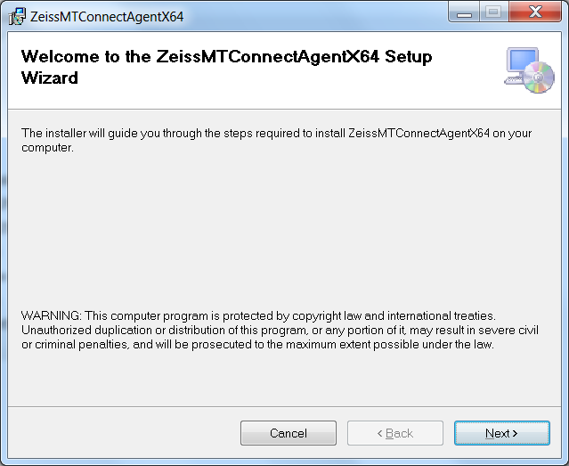
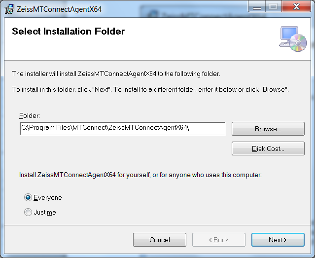
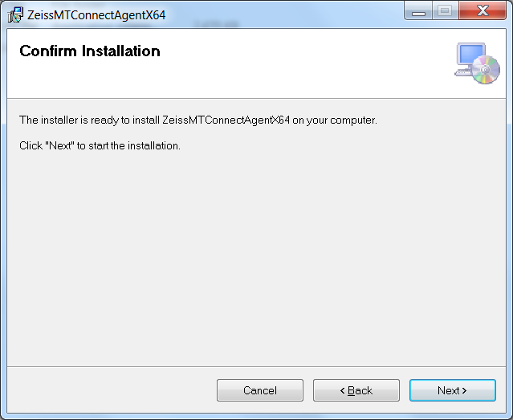
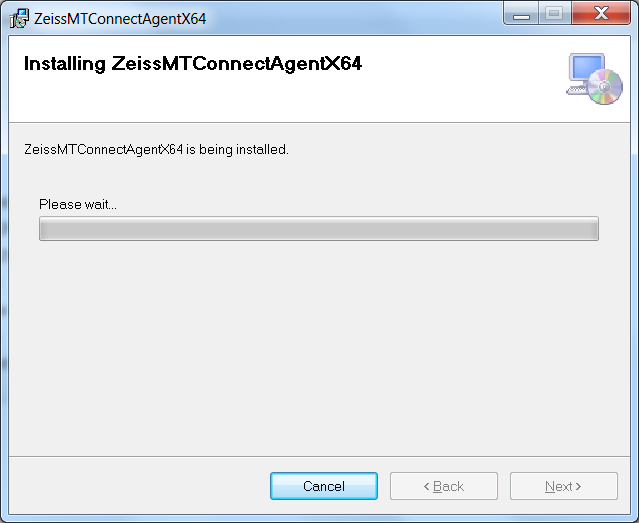
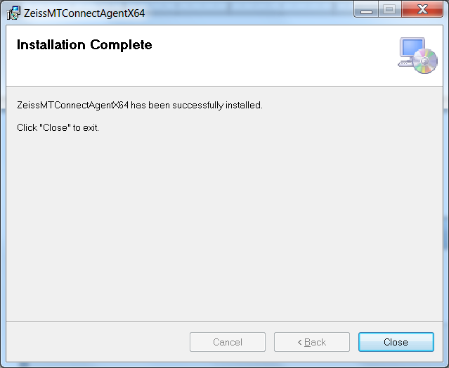
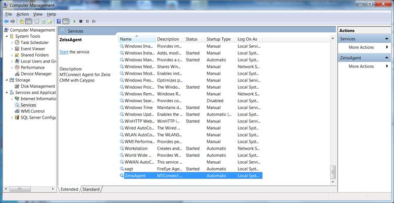
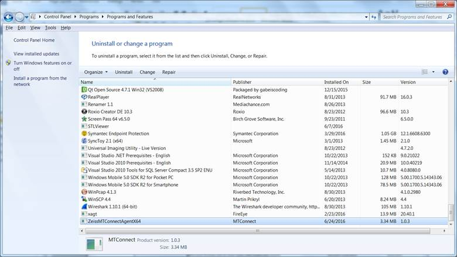
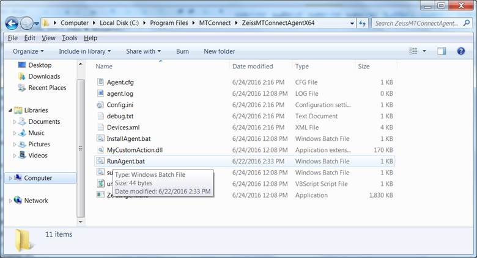

<html>

<body lang=EN-US link=blue vlink=purple>

ZEISS LOGFILE README

6/28/2016 3:39:13 PM

This document describes the data gathering for a Zeiss CMM
machine that updates a tab separated log file. Multiple adapters to Zeiss
software are possible, each contained within one MTConnect Agent.

The ZEISS Agent contains back end adapters that read a log
file generated from the CMM periodically (typically when an event occurs within
the CMM). The log file contains events and not samples, but all the events are
time stamped and in absolute order of occurrence.

The file is specified as a Window cross-platform file, so it
must contain the PC or computer name. UNC is  short for Universal Naming
Convention and specifies a Windows syntax to describe the location of a network
resource, such as a shared file, directory, or printer. The UNC syntax for
Windows systems has the generic form:

\\ComputerName\SharedResource

In our case the SharedResource is a shared file that must be
explicitly sharable. In order to use the UNC file, Microsoft File Operations:
CreateFile, ReadFile and CloseFile are used as other generic C++ file
operations did not work (but were originally tried.) UNC files on Windows seem
to require Windows specific File operations. Note, the UNC file path must be
accessible to other computers or it cannot be read.mInside the Agent are
Adapters for each UNC file. Each Adapter runs as a thread, hence the
distinction between 64 bit and 32 bit C++ solutions must be explicitly acknowledged
in installing the binary exe. That is, 32-bit MTConnect agents do not on 64 bit
platforms, although they may appear to.

In the Zeiss file, it logs major events in a UNC shared
file. Below is a sample of the last line found in the Zeiss shared file. 

Measurement
Plan Name: 138Z4039-501

Run
Speed: 160 mm/s

Measurement
Start Time: 9:49:47 am

Measurement
End Time: 10:13:57 am

Duration
of Run: 00:24:21.0

Date of
Run: 2016-5-20 

Each run of a Zeiss inspection is logged, starting with a
plan name, run speed and start time. When the inspection is done the end time,
duration and date of run are logged. Unfortunately, the date of the run
(inspection) occurs after the inspection has completed, thus, no error
detection of runaway date or times can be done.  

There are three fields of interest, plan name, start time,
and speed event.

<table class=MsoTableLightListAccent5 border=1 cellspacing=0 cellpadding=0
 style='border-collapse:collapse;border:none'>
 <tr style='height:11.7pt'>
  <td width=237 valign=top style='width:142.25pt;border-top:solid #4BACC6 1.0pt;
  border-left:solid #4BACC6 1.0pt;border-bottom:none;border-right:none;
  background:#4BACC6;padding:0in 5.4pt 0in 5.4pt;height:11.7pt'>
  
<b>Field</b>

  </td>
  <td width=383 valign=top style='width:229.65pt;border-top:solid #4BACC6 1.0pt;
  border-left:none;border-bottom:none;border-right:solid #4BACC6 1.0pt;
  background:#4BACC6;padding:0in 5.4pt 0in 5.4pt;height:11.7pt'>
  
<b>Example</b>

  </td>
 </tr>
 <tr style='height:11.7pt'>
  <td width=237 valign=top style='width:142.25pt;border:solid #4BACC6 1.0pt;
  border-right:none;padding:0in 5.4pt 0in 5.4pt;height:11.7pt'>
  
<b>Start timestamp</b>

  </td>
  <td width=383 valign=top style='width:229.65pt;border:solid #4BACC6 1.0pt;
  border-left:none;padding:0in 5.4pt 0in 5.4pt;height:11.7pt'>
  
9:48:56 am or pm

  </td>
 </tr>
 <tr style='height:12.35pt'>
  <td width=237 valign=top style='width:142.25pt;border:none;border-left:solid #4BACC6 1.0pt;
  padding:0in 5.4pt 0in 5.4pt;height:12.35pt'>
  
<b>End time</b>

  </td>
  <td width=383 valign=top style='width:229.65pt;border:none;border-right:solid #4BACC6 1.0pt;
  padding:0in 5.4pt 0in 5.4pt;height:12.35pt'>
  
9:58:56 am or pm

  </td>
 </tr>
 <tr style='height:12.35pt'>
  <td width=237 valign=top style='width:142.25pt;border:solid #4BACC6 1.0pt;
  border-right:none;padding:0in 5.4pt 0in 5.4pt;height:12.35pt'>
  
<b>date</b>

  </td>
  <td width=383 valign=top style='width:229.65pt;border:solid #4BACC6 1.0pt;
  border-left:none;padding:0in 5.4pt 0in 5.4pt;height:12.35pt'>
  
01/23/2014  

  </td>
 </tr>
 <tr style='height:12.35pt'>
  <td width=237 valign=top style='width:142.25pt;border:none;border-left:solid #4BACC6 1.0pt;
  padding:0in 5.4pt 0in 5.4pt;height:12.35pt'>
  
<b>Plan Name</b>

  </td>
  <td width=383 valign=top style='width:229.65pt;border:none;border-right:solid #4BACC6 1.0pt;
  padding:0in 5.4pt 0in 5.4pt;height:12.35pt'>
  
138Z4039-501

  </td>
 </tr>
 <tr style='height:12.35pt'>
  <td width=237 valign=top style='width:142.25pt;border:solid #4BACC6 1.0pt;
  border-right:none;padding:0in 5.4pt 0in 5.4pt;height:12.35pt'>
  
<b>Speed (mm/sec)</b>

  </td>
  <td width=383 valign=top style='width:229.65pt;border:solid #4BACC6 1.0pt;
  border-left:none;padding:0in 5.4pt 0in 5.4pt;height:12.35pt'>
  
160

  </td>
 </tr>
</table>

&nbsp;

These log fields, specifically the field 5 “status” offers
sufficient information to develop a stack lite state model. Below is the
translation of the Zeiss status messages into MTConnect controller logic:

<table class=MsoTableLightListAccent5 border=1 cellspacing=0 cellpadding=0
 style='border-collapse:collapse;border:none'>
 <tr style='height:11.7pt'>
  <td width=279 valign=top style='width:167.4pt;border-top:solid #4BACC6 1.0pt;
  border-left:solid #4BACC6 1.0pt;border-bottom:none;border-right:none;
  background:#4BACC6;padding:0in 5.4pt 0in 5.4pt;height:11.7pt'>
  
<b>State</b>

  </td>
  <td width=428 valign=top style='width:256.5pt;border-top:solid #4BACC6 1.0pt;
  border-left:none;border-bottom:none;border-right:solid #4BACC6 1.0pt;
  background:#4BACC6;padding:0in 5.4pt 0in 5.4pt;height:11.7pt'>
  
<b>Action</b>

  </td>
 </tr>
 <tr style='height:11.7pt'>
  <td width=279 valign=top style='width:167.4pt;border:solid #4BACC6 1.0pt;
  border-right:none;padding:0in 5.4pt 0in 5.4pt;height:11.7pt'>
  
<b>End time detected</b>

  </td>
  <td width=428 valign=top style='width:256.5pt;border:solid #4BACC6 1.0pt;
  border-left:none;padding:0in 5.4pt 0in 5.4pt;height:11.7pt'>
  
power=ON

  
controllermode=MANUAL

  
execution=IDLE

  
program = “”

  
feed=0

  </td>
 </tr>
 <tr style='height:11.7pt'>
  <td width=279 valign=top style='width:167.4pt;border:none;border-left:solid #4BACC6 1.0pt;
  padding:0in 5.4pt 0in 5.4pt;height:11.7pt'>
  
<b>Start time</b>

  </td>
  <td width=428 valign=top style='width:256.5pt;border:none;border-right:solid #4BACC6 1.0pt;
  padding:0in 5.4pt 0in 5.4pt;height:11.7pt'>
  
power=ON

  
controllermode=AUTOMATIC

  
execution=EXECUTING

  
program = plan name

  
feed = speed

  </td>
 </tr>
 <tr style='height:12.35pt'>
  <td width=279 valign=top style='width:167.4pt;border:solid #4BACC6 1.0pt;
  border-right:none;padding:0in 5.4pt 0in 5.4pt;height:12.35pt'>
  
<b>Side effects</b>

  </td>
  <td width=428 valign=top style='width:256.5pt;border:solid #4BACC6 1.0pt;
  border-left:none;padding:0in 5.4pt 0in 5.4pt;height:12.35pt'>
  
RPM and xyz move if automatic and executing

  </td>
 </tr>
 <tr style='height:12.35pt'>
  <td width=279 valign=top style='width:167.4pt;border-top:none;border-left:
  solid #4BACC6 1.0pt;border-bottom:solid #4BACC6 1.0pt;border-right:none;
  padding:0in 5.4pt 0in 5.4pt;height:12.35pt'>
  
<b>&nbsp;</b>

  </td>
  <td width=428 valign=top style='width:256.5pt;border-top:none;border-left:
  none;border-bottom:solid #4BACC6 1.0pt;border-right:solid #4BACC6 1.0pt;
  padding:0in 5.4pt 0in 5.4pt;height:12.35pt'>
  
&nbsp;

  </td>
 </tr>
</table>

Because of the deficiency of the MTConnect state logic, some
side effects are generated to make the controller appear to be operating:
positions for x,y,z and RPM change after every update if the controller is in
automatic mode and executing.

Some MTConnect tags are updated indepently of the contents
of the log file, these include:

<table class=MsoTableLightListAccent5 border=1 cellspacing=0 cellpadding=0
 style='border-collapse:collapse;border:none'>
 <tr style='height:12.35pt'>
  <td width=620 colspan=2 valign=top style='width:371.9pt;border:solid #4BACC6 1.0pt;
  border-bottom:none;background:#4BACC6;padding:0in 5.4pt 0in 5.4pt;height:
  12.35pt'>
  
<b>SIDE EFFECTS</b>

  </td>
 </tr>
 <tr style='height:12.35pt'>
  <td width=237 valign=top style='width:142.25pt;border:solid #4BACC6 1.0pt;
  border-right:none;padding:0in 5.4pt 0in 5.4pt;height:12.35pt'>
  
<b>power</b>

  </td>
  <td width=383 valign=top style='width:229.65pt;border:solid #4BACC6 1.0pt;
  border-left:none;padding:0in 5.4pt 0in 5.4pt;height:12.35pt'>
  
ON/OFF depending if log file found

  </td>
 </tr>
 <tr style='height:12.35pt'>
  <td width=237 valign=top style='width:142.25pt;border:none;border-left:solid #4BACC6 1.0pt;
  padding:0in 5.4pt 0in 5.4pt;height:12.35pt'>
  
<b>AVAIL</b>

  </td>
  <td width=383 valign=top style='width:229.65pt;border:none;border-right:solid #4BACC6 1.0pt;
  padding:0in 5.4pt 0in 5.4pt;height:12.35pt'>
  
AVAILABLE

  </td>
 </tr>
 <tr style='height:12.35pt'>
  <td width=237 valign=top style='width:142.25pt;border:solid #4BACC6 1.0pt;
  border-right:none;padding:0in 5.4pt 0in 5.4pt;height:12.35pt'>
  
<b>last_update</b>

  </td>
  <td width=383 valign=top style='width:229.65pt;border:solid #4BACC6 1.0pt;
  border-left:none;padding:0in 5.4pt 0in 5.4pt;height:12.35pt'>
  
Most recent line with “:” in it

  </td>
 </tr>
 <tr style='height:12.35pt'>
  <td width=237 valign=top style='width:142.25pt;border-top:none;border-left:
  solid #4BACC6 1.0pt;border-bottom:solid #4BACC6 1.0pt;border-right:none;
  padding:0in 5.4pt 0in 5.4pt;height:12.35pt'>
  
<b>heartbeat</b>

  </td>
  <td width=383 valign=top style='width:229.65pt;border-top:none;border-left:
  none;border-bottom:solid #4BACC6 1.0pt;border-right:solid #4BACC6 1.0pt;
  padding:0in 5.4pt 0in 5.4pt;height:12.35pt'>
  
Increments every data gathering

  </td>
 </tr>
</table>

<h1>Installation</h1>

To install the Nikon Agent double click the (for 64 bit
machines only). These installation instructions have only been tested on
Windows 7 Enterprise edition PC.

&nbsp;

&nbsp;

&nbsp;

&nbsp;

&nbsp;

&nbsp;

&nbsp;

Acknowledge the installation permission challenge (you must
have administrator rights to install the mtconnect agent) then you should see
the installation screen:

If you bring up Services in the Computer Management ( enter
“<b><i>compmgmt.msc” </i></b>in Run command line, then browse tree for
services – see below.) Again, you must have administrator rights to view this
screen, and you will be challenged to authenticate that you have access rights.

The agent will NOT start unless you tell it to START (unless
you reboot).

<h1>Uninstall</h1>

First make sure the Nikon Agent is stopped in the Service
Control Manager:

Right click on My Computer -&gt; Select Manage -&gt;
Acknowledge UAC challenge

Select Services and Applications and then Services, scroll
down to ZeissAgent, and push Stop button.

After you have stopped the Nikon Agent service, go into the
control panel and uninstall the program: MTConnectAgentNikonx64

&nbsp;

&nbsp;

&nbsp;

Please wait .. acknowledge UAC permission to uninstall
challenge (you must be administrator or have administrator priviledges).  It
will uninstall and you may see a black console screen popup in the background
momemtarily.

And then in the Service Manager click Action-&gt;Refresh,
and the Nikon Agent service should be removed. The agent code in C:\Program
Files\MTConnect\MTConnectAgentNikonx64 should also be removed.

<h1>Configuration</h1>

The installation wizard installs the log file Agent into the
folder: C:\Program Files\MTConnect\ZeissMTConnectAgentX64 where X64 means a 64
bit installation platform, e.g., windows 7. The MTConnect Agent executable <u>must
be paired with the correct platform</u> (32 or 64 bit).

In the folder, the vb script MTConnectPage-1.4.vbs in the
can be used to verify that the log file Agent is working. MTConnectPage-1.4.vbs
reads the data from the agent via <a href="http://127.0.0.1:5000">http://127.0.0.1:5000</a>
and then formats the data. (assuming you have configure the agent port to
5000).

<h1>Configuration</h1>

<h2>Configuring MTConnect Devices</h2>

Configuration of the Devices.xml file is done with the
Config.ini file.  The LogFile Agent looks in the [GLOBALS] section at the
“MTConnectDevice” tag to see how many devices with accompanying sections are
defined.  (The device name must be unique, but no check is done.)  For example,

[GLOBALS]

MTConnectDevice=M1

specifies a device M1, which has a unique section in the
Config.ini file that defines all the necessary configuration parameters
required. For actual deployment in a shop environment, only the ini file tag
“ProductionLog” is important and must be instantiated, because the embedded
MTConnect “Adapter” must know where the log file is located. 

[M1]

ProductionLog=C:\Users\michalos\Documents\GitHub\Agents\AgfmMTConnectAgent\AgfmAgent\x64\Debug\ProductionLog.csv

Typically, a UNC file name is used to describe the file for
the production log. In the example above used for testing, a local file is
shown.

In the UNC Name Syntax UNC names identify network resources
using a specific notation. UNC names consist of three parts - a server name, a
share name, and an optional file path. These three elements are combined using
backslashes as follows:

\\server\share\file_path

The server portion of a UNC name references the strings
maintained by a network naming service such as DNS or WINS. Server names are
“computer names”. The share portion of a UNC name references a label created by
an administrator or, in some cases, within the operating system. In most
versions of Microsoft Windows, for example, the built-in share name admin$
refers to the root directory of the operating system installation (usually
C:\WINNT or C:\WINDOWS). The file path portion of a UNC name references the
local subdirectories beneath the share point. For example:

\\grandfloria\temp
(to reach C:\temp on the computer grandfloria)

In this example, the file temp must be shared to allow
remote access for MTConnect to read the file. Also, file permissions must allow
read access to this file. This may require administrator privileges in order to
perform the file read. The embedded MTConnect adapter only reads the file, it
does not write, delete or modify in any manner the contents of the log file. It
is on the onus of the logging service of the CNC to modify the log file.
Excessively large log files, will result in delays reading thru the log file to
reach the latest reading (typically because we cannot be sure what, when is
recorded in the log file.) 

A complete config.ini file is shown below:

[GLOBALS]

Config=UPDATED

Debug=0

MTConnectDevice=M1,M2

ServiceName=ZeissAgent

logging_level=FATAL

QueryServer=10000

ServerRate=5000

AgentPort=5010

&nbsp;

[M1]

ProductionLog=C:\Users\michalos\Documents\GitHub\Agents\ZeissMTConnectAgent\ZeissAgent\x64\Debug\RunTracker.txt

&nbsp;

[M2]

ProductionLog=\\bpq465\log\events.log

&nbsp;

There are three sections in the config.ini file: Globals,
M1, and M2.  In the Globals section, the Config tag can be New or Updated. If
New, then a devices.xml file is generated based on the names of the
MTConnectDevice tag. The MTConnectDevice tag specifies the devices for which to
monitor the log file.  In this case, device “M1” and “M2” are  specified, each
with its own ini file section. The tag ServiceName specifies that the service
that runs will be called ZeissAgent, and monitor the http port specified by
AgentPort (i.e., 5010). The ServerRate tag specifies the wait in milliseconds
between log file reads. The QueryServer flag specifies the wait in milliseconds
in which to try to reconnect to the log file, if that read fails.

Sections [M1] and [M2] each contains a ProductionLog tag
that give the accompanying log file name for that device.

<h1>Add devices after installation</h1>

Modify Config.ini in C:\Program
Files\MTConnect\ZeissAgentx64directory

1)&nbsp;&nbsp;&nbsp;&nbsp;&nbsp;
Stop Zeiss agent, edit config.ini
file, add new configuration:

&nbsp;

[GLOBALS]

Config=NEW

&nbsp;

2)&nbsp;&nbsp;&nbsp;&nbsp;&nbsp;
Add new devices under [GLOBALS]
section tag “MTConnectDevice” (spaces are stripped out)

&nbsp;

MTConnectDevice=M1,
M2, M3

&nbsp;

3)&nbsp;&nbsp;&nbsp;&nbsp;&nbsp;
Make sure there is an ini file
“section” for each device (in this case M1, M2, M3) and ProductionLog tag that
points to the UNC (Windows Universal Naming Convention) path to the log file as
in:

&nbsp;

[M1]

ProductionLog=\\grandflorio\c$\logfolder\Events_log_BP_NIKON.txt

[M2]

ProductionLog=\\rufous\c$\logfolder\Events_log_BP_NIKON.txt

[M3]

ProductionLog=\\synchro\c$\logfolder\Events_log_BP_NIKON.txt

4)&nbsp;&nbsp;&nbsp;&nbsp;&nbsp;
Start Ziess agent, the agent will
detect a new configuration, and then write a new Devices.xml file to add the
new devices.

5)&nbsp;&nbsp;&nbsp;&nbsp;&nbsp;
If it works config.ini tag should say
:”Config=UPDATED” if a problem tag will say: “Config=ERROR”

&nbsp;

<h2>Add network share</h2>

The MTConnect agent runs as a service, and thus has the
service rights. Service rights are generally local, and often cannot be used to
access network files across the enterprise domain. The following describes a
way to allow a domain user to access the files and then allow the MTConnect
agent service to access the file as a networked share.

1)&nbsp;&nbsp;&nbsp;&nbsp;&nbsp;
Add&nbsp; the lines in the config.ini
file section under each devices tag, in this case [M1]

[M1]

User=AGFM6449\oper

Pw=
Qwerty123\#

LocalShare=Z:

NetworkShare=\\Agfm6449\gfm\CNC\UserData_PRT\Logging

Some caveats are in orders. It is apparent that plain
password are not good. Further, you cannot use the same letter for the local
network share.

<h1>Version Information from MTConnect Agent</h1>

The version information of the various MTConnect components
is  available through web browser access. It is recommended to use Google
Chrome as it understand the XSLT formatting of the XML (Internet Explorer is
baffled.) 

The open source core MTConnect agent is downloaded from
github and “frozen”. The version used is:

MTConnect
Agent Version 1.2.0.0 - built on Sat Oct 12 13:30:24 2013

It is not perfect but the output shown below gives an
indication of the software involved in the MTConnect Agent operation. It can be
modified to include other version information, but requires a recompilation at
this time.

<h2>&nbsp;</h2>

</body>

</html>
